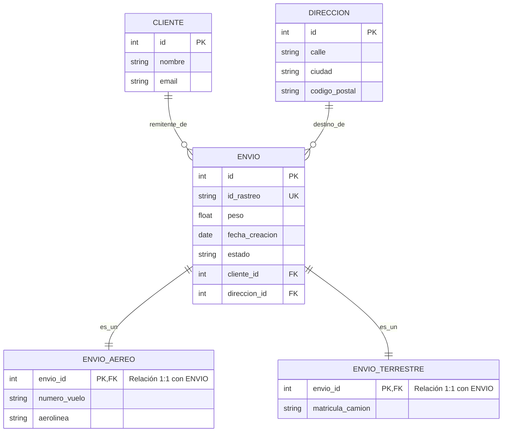
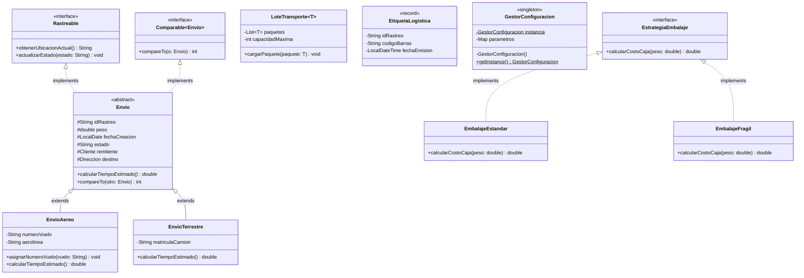

# 🚀 Fast Track Logistics API
Este proyecto aplica los conceptos de la **Programación Orientada a Objetos pura**, los **Patrones de Diseño** y demuestra cómo pueden integrarse dentro del ecosistema de **Spring Boot** para crear un producto de software.

---

## 📑 Tabla de Contenidos
1. [Acerca del Proyecto](#-acerca-del-proyecto)
2. [Arquitectura y Decisiones de Ingeniería](#-arquitectura-y-decisiones-de-ingeniería)
3. [Aplicación de la Rúbrica (Showcase Técnico)](#-aplicación-de-la-rúbrica-showcase-técnico)
4. [Stack Tecnológico](#-stack-tecnológico)
5. [Ejecución y Pruebas](#-ejecución-y-pruebas)

---

## 📦 Acerca del Proyecto
El sistema resuelve la gestión del ciclo de vida de envíos logísticos (Aéreos y Terrestres). Su objetivo principal es asegurar la integridad de los datos de negocio, calculando dinámicamente costos de embalaje y previniendo transiciones de estado ilógicas a través de una API REST fuertemente documentada.

---

## 🏗 Arquitectura y Decisiones de Ingeniería

Diseñé este proyecto siguiendo principios de separación de responsabilidades (Clean Architecture en capas) y normalización estricta de bases de datos.

* **Diseño de Base de Datos (Estrategia JOINED):** En lugar de usar una tabla única con valores nulos, implementé una herencia relacional estricta usando `@Inheritance(strategy = InheritanceType.JOINED)`. Esto garantiza una base de datos normalizada donde los datos específicos de envíos aéreos y terrestres viven en sus propias tablas, vinculados por llaves foráneas.
* **Máquina de Estados de Negocio:** El ciclo de vida de un paquete no es un simple texto. Implementé un `Enum` inteligente que actúa como Máquina de Estados, bloqueando transiciones no válidas (ej. pasar de `CREADO` a `ENTREGADO` sin estar `EN_TRANSITO`).
* **Protección del Dominio (Manejo Global de Errores):** La API está protegida con un `@RestControllerAdvice` que intercepta cualquier violación de negocio o error de validación, devolviendo un JSON estructurado y ocultando las excepciones internas del servidor al cliente.

### Diagrama Entidad-Relación (ERD)

### Modelado de Dominios

---

## 🎯 Aplicación de la Rúbrica (Showcase Técnico)
A continuación, muestro en qué partes del código fuente implementé los requerimientos específicos:

### 1. Java Core y POO Avanzada
 
- **Herencia y Polimorfismo**: Implementado en la clase abstracta base `Envio`, de la cual extienden `EnvioAereo` y `EnvioTerrestre`. El servicio principal inyecta polimorfismo al decidir qué objeto instanciar según el Payload.
- **Inmutabilidad y Records**: Uso de Java Records para la generación de objetos de solo lectura como `EtiquetaLogistica` y para el transporte de datos seguros (DTOs).
- **Generics**: Implementación de `LoteTransporte<T extends Envio>` asegurando la seguridad de tipos en colecciones en memoria.
### 2. Colecciones, Lambdas y Streams
 
- **Ordenamiento Funcional**: En el método `obtenerTodosLosEnvios` (`GestorEnviosService.java`), utilicé Lambdas y la interfaz `Comparator` para ordenar las listas devueltas por la base de datos de manera dinámica según el parámetro recibido en la petición GET, y `Comparable` para el orden natural.
### 3. Patrones de Diseño Aplicados
 
En lugar de saturar el servicio con condicionales pesados, utilicé patrones en el paquete `core.strategy`:
 
- **Strategy**: Para el cálculo dinámico de tarifas de cajas (`EmbalajeEstandar`, `EmbalajeFragil`).
- **Clases Anónimas**: Utilizadas dentro del Strategy para resolver cotizaciones de tipos de embalaje no previstos (ej. Radiactivos).
- **Singleton**: La clase `GestorConfiguracion` se encarga de mantener una única instancia en memoria para parámetros globales, como el impuesto local.
### 4. Pruebas Unitarias y Automatización (Testing)
 
- **Aislamiento con Mockito**: La lógica de la Máquina de Estados se encuentra probada mediante JUnit 5 en `GestorEnviosServiceTest`. Usé anotaciones `@Mock` e `@InjectMocks` para simular la base de datos, garantizando que las reglas de negocio funcionen.
---
 
## 🛠 Stack Tecnológico
 
| Categoría | Tecnología |
|---|---|
| Lenguaje | Java 21 |
| Framework Core | Spring Boot 4+ (Web, Data JPA, Validation) |
| Base de Datos | H2 Database (En memoria) para facilitar la prueba técnica sin configuraciones externas |
| Documentación API | OpenAPI 3 / Swagger (springdoc-openapi) |
| Testing | JUnit 5 (Jupiter) & Mockito |
 
---
 
## 🚀 Ejecución y Pruebas
 
Para levantar este proyecto localmente y explorar su funcionalidad:
 
1. Clona este repositorio y ábrelo en tu IDE.
2. Ejecuta la clase principal `LogisticaApplication.java`.
3. Spring Boot inicializará H2 y creará automáticamente el esquema relacional (`Hibernate: create table...`).
### Interfaces para Desarrolladores
 
Una vez que el servidor reporte `Started LogisticaApplication on port 8080`, puedes acceder a los siguientes paneles:
 
- 📖 **Documentación Interactiva (Swagger UI)**: Navega a `http://localhost:8080/v3/api-docs` para ver el contrato de la API y realizar peticiones de prueba fácilmente.
- 🗄️ **Consola de Base de Datos H2**: Navega a `http://localhost:8080/h2-console` (JDBC URL: `jdbc:h2:mem:fasttrackdb`, User: `sa`, Pass: vacío) para inspeccionar cómo la herencia JOINED inserta los datos físicos.
 

