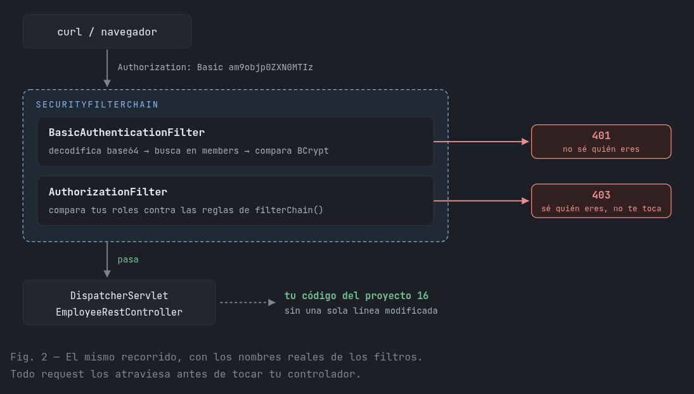
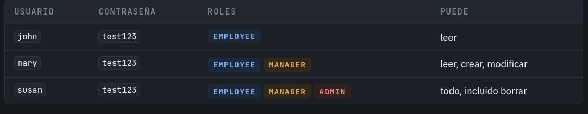

# HTTP Basic.
Para el manejo de la seguridad de una API tenemos 3 
métodos distintos para resolver esto. No es que una 
sea mejor que otra, son tres escalones que apuntan
a una necesidad diferente cada una. 

El primer escalón de estos es el uso de **HTTP Basic**.

## Funcionamiento
Dentro de este método, cada que se pide algo, se manda
el usuario y la contraseña dentro de la petición.

El servidor se encarga de verificar estas credenciales
y decidir si permitir el acceso o no. 

## Cadena de Filtros
Spring Security no vive dentro de tu controlador. Vive antes. Se mete en la fila de filtros por la que pasa todo request antes 
de poner llegar a algún controlador definido dentro del proyecto.



## Problema
- Las credenciales (usuario y contraseña) viajan de 
manera plana, sin cifrado. Esto expone una vulnerabilidad si alguien se encuentra interceptando dicha petición.
***Recordemos este problema***

- Para realizar la autenticación/autorización, el sistema necesita consultar la tabla de Usuarios en la Base de Datos
en cada petición.
## ¿Cómo lo configuramos en este proyecto?
1. Agregamos la dependencia dentro de pom.xml:
```xml
<dependency>
    <groupId>org.springframework.boot</groupId>
    <artifactId>spring-boot-starter-security</artifactId>
</dependency>
```
2. Creamos una tabla de Usuarios dentro de nuestra base de datos. Este proyecto cuenta con los siguiente campos:
   - Usuario
   - Contraseña
   - Roles


3. Creamos nuestra clase de configuración dentro de nuestro paquete: **security/SecurityConfig.java**
```java
@Configuration
@EnableWebSecurity
public class SecurityConfig {

    @Bean
    public UserDetailsService userDetailsService(DataSource theDataSource) {

        JdbcUserDetailsManager theUserDetailsManager = new JdbcUserDetailsManager(theDataSource);

        theUserDetailsManager.setUsersByUsernameQuery(
                "select user_id, pw, active from members where user_id=?");

        theUserDetailsManager.setAuthoritiesByUsernameQuery(
                "select user_id, role from roles where user_id=?");

        return theUserDetailsManager;
    }

    @Bean
    public SecurityFilterChain filterChain(HttpSecurity http) throws Exception {

        http.authorizeHttpRequests(configurer -> configurer
                .requestMatchers(HttpMethod.GET,    "/api/pokemons").hasRole("EMPLOYEE")
                .requestMatchers(HttpMethod.GET,    "/api/pokemons/**").hasRole("EMPLOYEE")
                .requestMatchers(HttpMethod.POST,   "/api/pokemons").hasRole("MANAGER")
                .requestMatchers(HttpMethod.PUT,    "/api/pokemons").hasRole("MANAGER")
                .requestMatchers(HttpMethod.PATCH,  "/api/pokemons/**").hasRole("MANAGER")
                .requestMatchers(HttpMethod.DELETE, "/api/pokemons/**").hasRole("ADMIN")
                .anyRequest().authenticated());

        http.httpBasic(Customizer.withDefaults());
        http.csrf(csrf -> csrf.disable());
        http.sessionManagement(session -> session.sessionCreationPolicy(SessionCreationPolicy.STATELESS));

        return http.build();
    }
}
```
Ya tendríamos nuestro proyecto implementando Security HTTP Basic. Ahora para acceder a cada controller se realiza la 
Autenticación (Usuario y Contraseña) y Autorización conforme a los roles y qué tiene permitido hacer cada quién.

## Analizando SecurityConfig

```java
    @Bean
    public UserDetailsService userDetailsService(DataSource theDataSource) {
        JdbcUserDetailsManager theUserDetailsManager = new JdbcUserDetailsManager(theDataSource);
        
        theUserDetailsManager.setUsersByUsernameQuery(
                "select user_id, pw, active from members where user_id=?");
        theUserDetailsManager.setAuthoritiesByUsernameQuery(
                "select user_id, role from roles where user_id=?");

        return theUserDetailsManager;
    }
```
- Le dice a Spring que este método genera un bean de tipo **UserDetailService**.
- El parámetro **DataSource** es inyectado por Spring, es la conexión a la base de datos, configurado normalmente en **application.properties**.
- **JdbcUserDetailsManager** por defecto contiene un esquema de tablas **users** y **authorities**. Si desearamos usar dichos esquemas, no hacen falta las siguientes dos consultas.
- Consulta para autenticar usuario y contraseña:
  - **username**: user_id
  - **password**: pw, normalmente hasheado/cifrado
  - **enable**: active, booleano que indica si la cuenta está activa
- **Consulta para los roles/permisos**:
  - Esta consulta obtiene los roles o autoridades (por ejemplo, ROLE_ADMIN, ROLE_EMPLOYEE) asociados a ese usuario, buscando en la tabla roles. 
  También debe devolver dos columnas en orden: username y authority.
- **Retorno**: Se retorna el objeto configurado, que Spring Security usará automáticamente para el proceso de validaciones.

```java
    @Bean
    public SecurityFilterChain filterChain(HttpSecurity http) throws Exception {

        http.authorizeHttpRequests(configurer -> configurer
                .requestMatchers(HttpMethod.GET,    "/api/pokemons").hasRole("EMPLOYEE")
                .requestMatchers(HttpMethod.GET,    "/api/pokemons/**").hasRole("EMPLOYEE")
                .requestMatchers(HttpMethod.POST,   "/api/pokemons").hasRole("MANAGER")
                .requestMatchers(HttpMethod.PUT,    "/api/pokemons").hasRole("MANAGER")
                .requestMatchers(HttpMethod.PATCH,  "/api/pokemons/**").hasRole("MANAGER")
                .requestMatchers(HttpMethod.DELETE, "/api/pokemons/**").hasRole("ADMIN")
                .anyRequest().authenticated());

        http.httpBasic(Customizer.withDefaults());
        http.csrf(csrf -> csrf.disable());
        http.sessionManagement(session -> session.sessionCreationPolicy(SessionCreationPolicy.STATELESS));

        return http.build();
    }
```
- Spring inyecta un objeto **HttpSecurity** que permite ir configurando las reglas de seguridad de forma encadenada.
- Reglas de autorización por endpoint y método HTTP.
- **.anyRequest().authenticated()** es la regla "por defecto": cualquier otra petición no listada explícitamente solo requiere estar autenticado (sin importar el rol).
- **http.httpBasic(Customizer.withDefaults());**: Habilita autenticación básica HTTP, el cliente debe enviar un header **Authorization: Basic base64(usuario:contraseña)** en cada petición.
- **http.csrf(csrf -> csrf.disable());**: Es una protección pensada para aplicaciones web con sesiones y cookies/formularios. Aquí se deshabilita ya que no se usa nada de lo mencionado.
- **return http.build();**: Genera el objeto SecurityFilterChain con toda la configuración anterior, que Spring registra automáticamente para interceptar todas las peticiones entrantes.

