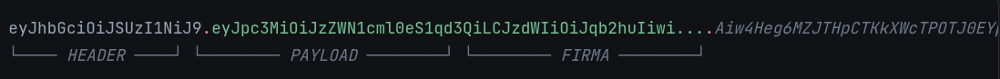

# JWT - JSON Web Tokens (El Pase)
Con HTTP Basic la contraseña viajaba en cada petición. Ahora con JWT solo viaja una vez, la primer vez, y esta es intercambiada por un *token de acceso* el cual viene firmado con una fecha de caducidad. Tablas, roles, y reglas de autorización siguen siendo las mismas.

***Solo cambia lo que llevas en un Header en una petición***

## Funcionamiento
- La contraseña viajaba una vez en el login. Esta es intercambiada por el *access_token* el cual es el que ahora viaja en las peticiones
- El token trae fecha de expiración
- El token dice qué puedes hacer

## Anatomía de un JWT
Es una estructura de tres partes separadas por puntos (**Header.Payload.Signature**):
- **Header**: Algoritmo y tipo de token
- **Payload**: Datos del usuario (roles, expiración).
- **Signature**: Firma generada con una clave secreta o llave pública/privada para garantizar inmutabilidad.



Estas tres partes están en **base64**, no cifradas. Por lo que cualquiera que intercepte el token puede leer el contenido completo, por eso mismo, un JWT nunca debe de llevar contraseñas o información sensible dentro de su *payload*.

***JWT no garantiza que nadie pueda leerlo, sino que nadie pudo modificarlo***

## Firmar vs Cifrar
Cifrar significa esconder el contenido: nadie sin la llave puede leerlo.

Firmar es otra cosa completamente distinta: el contenido sigue siendo legible por cualquiera, pero se le pega un "sello" matemático que depende exactamente de ese contenido. Si alguien cambia una sola letra del payload, ese sello ya no coincide y el servidor lo detecta al validar.

En este proyecto ese sello se genera con **RS256**, que en la práctica usa dos archivos distintos:

- **private.pem**: nunca sale del servidor. Es la única que puede generar sellos válidos (firmar tokens nuevos).
- **public.pem**: se puede compartir sin problema. Sirve únicamente para comprobar que un sello es legítimo, pero con ella es imposible crear uno nuevo.

Esto es justo lo que hacen los dos beans **jwtEncoder()** y **jwtDecoder()** de mi **SecurityConfig**: uno recibe ambas llaves porque necesita la privada para firmar, y el otro solo recibe la pública porque solo necesita confirmar que la firma es correcta

## Analizando SecurityConfig con JWT.
```java
@Bean
@Order(1)
public SecurityFilterChain loginFilterChain(HttpSecurity http) throws Exception {
    http.securityMatcher("/api/auth/**");
    http.authorizeHttpRequests(configurer -> configurer.anyRequest().authenticated());
    http.httpBasic(Customizer.withDefaults());
    ...
}
```
- **http.securityMatcher("/api/auth/...");**: esta configuración de seguridad solo aplica a las rutas que empiecen con **/api/auth/**.
- **http.authorizeHttpRequests(...);**: Cualquiera que quiera tiene que identificarse, no importa qué pida
- **httpBasic()**: La forma de identificación es mediante tu usuario y contraseña directo (Basic Auth)

```java
@Bean
public JwtEncoder jwtEncoder() {
    JWK jwk = new RSAKey.Builder(publicKey).privateKey(privateKey).build();
    JWKSource<SecurityContext> jwks = new ImmutableJWKSet<>(new JWKSet(jwk));
    return new NimbusJwtEncoder(jwks);
}

@Bean
public JwtDecoder jwtDecoder() {
    return NimbusJwtDecoder.withPublicKey(publicKey).build();
}
```
- **JwtEncoder** usa la llave privada — solo mi servidor la tiene, así que solo mi servidor puede firmar tokens válidos.
- **JwtDecoder** usa la llave pública — puede repartirse sin miedo, porque con ella solo se puede comprobar una firma, nunca crearla.

```java
@Bean
@Order(2)
public SecurityFilterChain apiFilterChain(HttpSecurity http) throws Exception {
    http.authorizeHttpRequests(configurer -> configurer
            .requestMatchers(HttpMethod.GET,    "/api/pokemons").hasRole("EMPLOYEE")
            .requestMatchers(HttpMethod.GET,    "/api/pokemons/**").hasRole("EMPLOYEE")
            .requestMatchers(HttpMethod.POST,   "/api/pokemons").hasRole("MANAGER")
            .requestMatchers(HttpMethod.PUT,    "/api/pokemons").hasRole("MANAGER")
            .requestMatchers(HttpMethod.PATCH,  "/api/pokemons/**").hasRole("MANAGER")
            .requestMatchers(HttpMethod.DELETE, "/api/pokemons/**").hasRole("ADMIN")
            .anyRequest().authenticated());

    http.oauth2ResourceServer(oauth2 -> oauth2.jwt(
            jwt -> jwt.jwtAuthenticationConverter(jwtAuthenticationConverter())));
    ...
}
```
- Esta es la línea más importante, le dice a Spring: "esta cadena ya no acepta usuario/contraseña (nada de **httpBasic**), solo acepta un JWT en el header **Authorization: Bearer <token>**

```java
private JwtAuthenticationConverter jwtAuthenticationConverter() {
    JwtGrantedAuthoritiesConverter authoritiesConverter = new JwtGrantedAuthoritiesConverter();
    authoritiesConverter.setAuthoritiesClaimName("roles");
    authoritiesConverter.setAuthorityPrefix("");

    JwtAuthenticationConverter converter = new JwtAuthenticationConverter();
    converter.setJwtGrantedAuthoritiesConverter(authoritiesConverter);
    return converter;
}
```
Por defecto, Spring Security busca un claim llamado **scope** y le agrega el prefijo **SCOPE_**. Si no se cambia esto, **hasRole("EMPLOYEE")** dejaría de funcionar porque Spring estaría buscando **SCOPE_EMPLOYEE**, no **ROLE_EMPLOYEE**.

## Vista General de JWT.
Con Basic yo mandaba la contraseña en cada petición y el servidor la revisaba en la base de datos cada vez. Con JWT mando la contraseña una sola vez, y a cambio recibo un papel firmado que dice quién soy y qué puedo hacer; ese papel es el que enseño de ahí en adelante.

Las reglas de quién puede hacer qué (**hasRole("EMPLOYEE")**, **hasRole("MANAGER")**, **hasRole("ADMIN")**) no se movieron, lo único que cambió fue de dónde saca Spring esa información: antes de una consulta a **roles**, ahora de un claim dentro del token.

