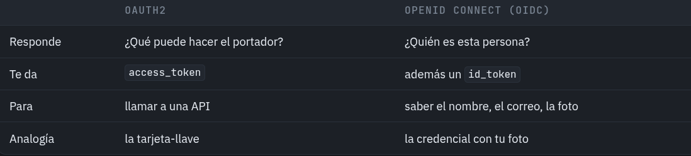

# Delegar: OAuth2 y OIDC
En este tercer escalón, nuestra API elimina código como lo es el **controlador del login**, las **llaves RSA**, y **tabla de usuarios**. Aún así, queda más seguro que nunca ya que los tokens son generados por **KeyCloak**, nuestra API solo se encarga de válidarlos.

## Que lo guarde otro
Es muy común en la actualidad que al entrar a algún sitio puedas tener la opción de autenticarte  con alguna otra herramienta como **Continuar con Google**, das click, se abre una ventana de inició de sesión de Google, ingresas tus credenciales, y una vez correcto todo, regresas a la web original ya identificado.

Esta web nunca vió tus credenciales, pero sabe quién eres. Este método cambia ***quién emite*** el acceso.

### Una sola llave es necesaria
Esto ayuda cuando se tienen muchas aplicaciones o servicios, el usuario solo se necesita identificar **una sola vez** y ya se tiene acceso a todo. 

## OAuth2 no es OIDC

OAuth2 es autorización; OpenID Connect es autenticación.



## Configuración dentro de Proyecto
- Usamos la misma dependencia
```xml
<dependency>
    <groupId>org.springframework.boot</groupId>
    <artifactId>spring-boot-starter-oauth2-resource-server</artifactId>
</dependency>
```
- Agregamos la siguiente linea dentro de **application.properties** la cual conecta a nuestro servicio de KeyCloak levantado en el puerto 8090 dentro de un Docker container.
```bash
spring.security.oauth2.resourceserver.jwt.issuer-uri=http://localhost:8090/realms/academy
```
- Desaparece la clase **AuthController.java**
- Y dentro de nuestra clase **SecurityConfig** desaparecen todos los métodos relacionados a la firma y validación de tokens, ya que de esto se encarga el servicio de KeyCloak. Nos queda así de simplificada:
```java
@Bean
    public SecurityFilterChain filterChain(HttpSecurity http) throws Exception {

        http.authorizeHttpRequests(configurer -> configurer
                .requestMatchers(HttpMethod.GET,    "/api/pokemons").hasRole("EMPLOYEE")
                .requestMatchers(HttpMethod.GET,    "/api/pokemons/**").hasRole("EMPLOYEE")
                .requestMatchers(HttpMethod.POST,   "/api/pokemons").hasRole("MANAGER")
                .requestMatchers(HttpMethod.PUT,    "/api/pokemons").hasRole("MANAGER")
                .requestMatchers(HttpMethod.PATCH,  "/api/pokemons/**").hasRole("MANAGER")
                .requestMatchers(HttpMethod.DELETE, "/api/pokemons/**").hasRole("ADMIN")
                .anyRequest().authenticated());

        http.oauth2ResourceServer(oauth2 -> oauth2
                .jwt(jwt -> jwt.jwtAuthenticationConverter(jwtAuthenticationConverter()))
        );

        http.csrf(csrf -> csrf.disable());
        http.sessionManagement(session -> session.sessionCreationPolicy(SessionCreationPolicy.STATELESS));

        return http.build();
    }

    @Bean
    public JwtAuthenticationConverter jwtAuthenticationConverter() {
        JwtAuthenticationConverter converter = new JwtAuthenticationConverter();
        converter.setJwtGrantedAuthoritiesConverter(SecurityConfig::extraerRoles);
        return converter;
    }

    private static Collection<GrantedAuthority> extraerRoles(Jwt jwt) {
        Map<String, Object> realmAccess = jwt.getClaim("realm_access");
        if (realmAccess == null || realmAccess.get("roles") == null) return List.of();
        List<String> roles = (List<String>) realmAccess.get("roles");
        return roles.stream()
                .map(role -> (GrantedAuthority) new SimpleGrantedAuthority("ROLE_" + role))
                .toList();
    }
```

