# ☁️ Arquitectura y Pipeline CI/CD Automatizado en AWS

<p align="left">
  
  
  
  
  
  
  
  
</p>

---

## 📑 Tabla de Contenidos
- [🚀 Visión General del Proyecto](#-visión-general-del-proyecto)
- [1. 🛠️ Desglosando AWS y sus Servicios](#1-️-desglosando-aws-y-sus-servicios)
  - [👤 IAM - Identity Access Management](#-iam---identity-acces-management)
  - [🖥️ EC2 - Elastic Cloud Compute](#-ec2---elastic-cloud-compute)
  - [🪣 S3 - Simple Storage Service](#-s3---simple-storage-service)
  - [🗄️ RDS - Relational Database Service](#️-rds---relational-database-service)
  - [⚡ DynamoDB - NoSQL Database Service](#-dynamodb---nosql-database-service)
- [2. ⚙️ Creación de nuestro Pipeline](#2-️-creación-de-nuestro-pipeline)
  - [Paso 1: Crear un nuevo IAM Role](#paso-1-crear-un-nuevo-iam-role)
  - [Paso 2: Asignación de nuevo rol a EC2](#paso-2-asignación-de-nuevo-rol-a-ec2)
  - [Paso 3: Crear Agente CodeDeploy](#paso-3-crear-agente-codedeploy)
  - [Paso 4: Cableado del pipeline](#paso-4-cableado-del-pipeline)
- [3. 🎯 Conclusiones y Aprendizajes Clave](#3--conclusiones-y-aprendizajes-clave)

---

## 🚀 Visión General del Proyecto

Dentro de este proyecto se puso en práctica la automatización de despliegue del proyecto `taskflow-api` hacía un servidor `EC2` de AWS mediante la configuración de un `Pipeline` desde cero que hace uso de servicios de Amazon para la `build` de la aplicación, su depósito en un bucket de `S3`, y el uso de un agente para su `deploy` en una instancia `EC2`. 

Todo este pipeline creado y configurado nos permite que como desarrolladores al solo hacer **Push** hacia nuestro repositorio del proyecto, nuestro agente escucha dicho cambio y ejecuta el proceso de despliegue completo.

<div align="center">
  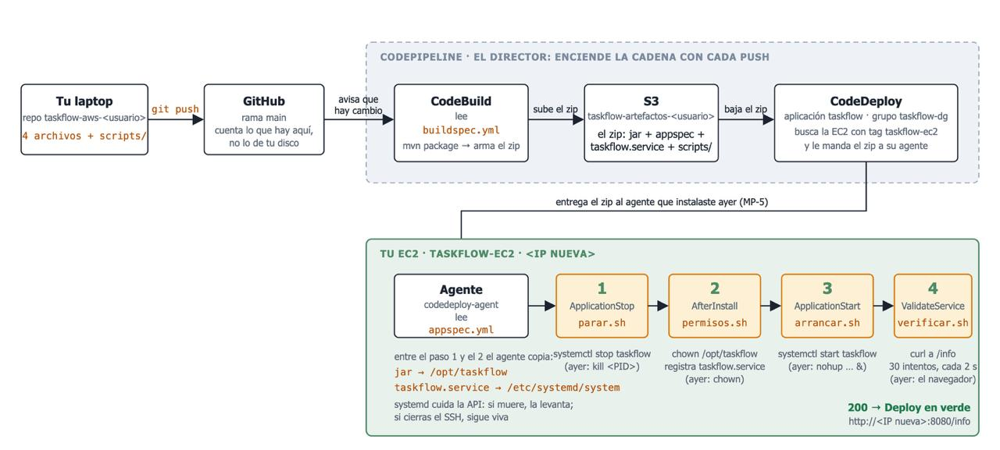
  <br>
  <sub><em>Arquitectura general y flujo del pipeline CI/CD en AWS</em></sub>
</div>

---

## 1. 🛠️ Desglosando AWS y sus servicios 

### 👤 IAM - Identity Acces Management

> Es el servicio de control de acceso global que administra la **autenticación** (quién eres) y la **autorización** (qué puedes hacer) para usar los recurso de AWS.

#### Componentes
- **Users**: Personas o servicios que interactúan con AWS. Cuentan con sus credenciales persistentes.
- **Groups**: Colecciones de Users IAM. Las políticas aplicadas a un grupo se heredan a cada miembro dentro de.
- **Roles**: Identidades temporales que pueden ser asumidas por cualquier entidad como un usuario, un servicio de AWS u otra cuenta. *No tienen credenciales a largo plazo.*
- **Policies**: Documentos en formato JSON que definen explícitamente los permisos (Allow/Deny).

#### Usuario Root

> Al crear una nueva cuenta de Amazon Web Services esta es creada mediante un usuario Root. Este usuario Root puede realizar todo tipo de acciones dentro de la consola, tiene poder absoluto y no puede ser restringido, por eso mismo no se recomienda usar el usuario Root en el día a día. Solo debe usarse para crear el primer usuario administrador y temas de facturación.

#### Usuario administrador

Dentro de este proyecto se creo nuestro usuario IAM administrador con el nombre de `taskflow-admin`. Como podemos observar en la imagen de la consola de AWS, tenemos nuestro `taskflow-admin` al cual se le adjuntó la Política de *AdministratorAcces*.

<div align="center">
  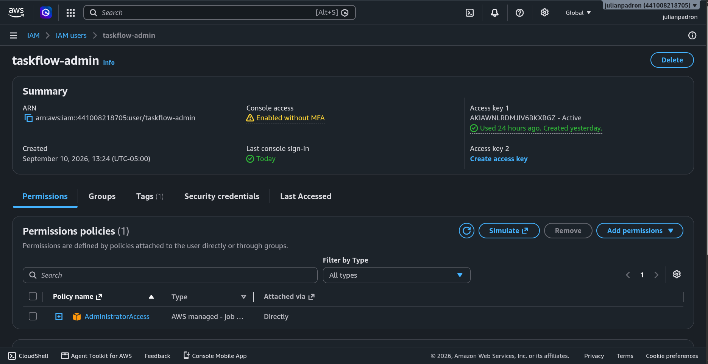
  <br>
  <sub><em>Usuario administrador taskflow-admin con política AdministratorAccess en la consola de IAM</em></sub>
</div>

> Una vez creado nuestro administrador, lo recomendable es cerrar sesión con el usuario Root e iniciar sesión mediante el apartado de **IAM user sign in** con sus credenciales para realizar todo el trabajo de manera segura y controlada.

<div align="center">
  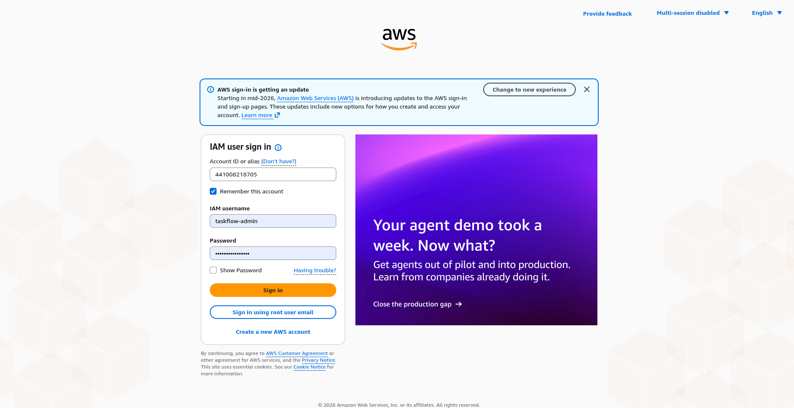
  <br>
  <sub><em>Inicio de sesión seguro a través del portal de usuarios IAM</em></sub>
</div>

---

### 🖥️ EC2 - Elastic Cloud Compute

> Amazon EC2 proporciona servidores virtuales llamados "instancias" en la nube. Nos permite alquilar poder de computo bajo demanda, elgiendo el sistema operativo, la cantidad de memoria, CPU y almacenamiento.

#### Componentes
- **AMI (Amazon Machine Image)**: Es la plantilla base del servidor. Contiene el sistema operativo y el software preinstalado necesario para arrancar la instancia.
- **Tipos de instancia**: El hardware virtual. Se dividen en familias según su propósito: T/M (Propósito general), C (Optimizadas para Computación), R (Optimizadas para Memoria RAM), etc.
- **Security Groups**: Actúan como un firewall virtual a nivel de instancia. Tú defines reglas de entrada (Inbound) y salida (Outbound), por ejemplo: permitir tráfico en el puerto 443 (HTTPS) o el 22 (SSH).
- **Key Pairs**: Credenciales de seguridad (claves públicas/privadas) que se usan para conectarse de forma segura a la instancia por SSH (en Linux).
- **User Data**: Un script que se ejecuta automáticamente *solo la primera vez* que arranca la instancia, ideal para instalar dependencias iniciales.

#### Usos ideales

| ✅ Ideales para | ❌ No ideales para |
|---|---|
| • **Aplicaciones monolíticas o microservicios personalizados:** Alojar backends complejos, APIs o aplicaciones heredadas que requieren control total sobre el sistema operativo.<br><br>• **Motor de base de datos específico:** Que AWS no ofrece en su servicio gestionado (RDS).<br><br>• **Ejecutar motores de Docker** directamente sobre la máquina virtual. | • **Alojamiento de sitios web estáticos:** Usar un EC2 solo para servir HTML/CSS/JS de React o Vue es matar moscas a cañonazos; es costoso y requiere mantenimiento.<br><br>• **Tareas de corta duración (Cron jobs rápidos):** Mantener un EC2 encendido 24/7 para ejecutar un script de 5 minutos al día es un desperdicio. |

#### Nuestra EC2

En nuestro panel de instancias dentro de la consola EC2 econtramos la instancia creada para el alojamiento de nuestro proyecto llamada `taskflow-ec2`. Esta instancia fue creada mediante el aprovechamiento de la capa Free-Tier que nos ofrece Amazon al crear nuestra cuenta, por lo que cuenta con los siguientes componentes:

| Componente | Especificación |
|---|---|
| **AMI** | Amazon Linux 2023 (`64-bit (x86)`) |
| **Tipo de Instancia** | `t3.micro` |
| **Almacenamiento** | 8 GiB gp3 |
| **vCPUs** | 2 |

<div align="center">
  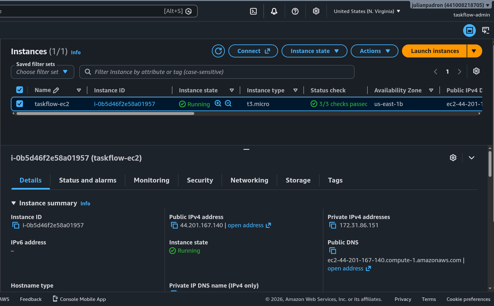
  <br>
  <sub><em>Configuración y especificaciones de la instancia taskflow-ec2</em></sub>
</div>

Al crear nuestra instancia en nuestras configuraciones de **Security** establecimos dos *Inbound Rules*, estas para establecer desde dónde puede recibir tráfico nuestra instancia. En este caso permite conexión por SSH al puerto 22 **únicamente desde la ip de nuestra computadora física**, y abre otra conexión hacía el puerto 8080, que es en el puerto que corre nuestra aplicación, desde **anywhere** (0.0.0.0/0). *Esto podría ser peligroso por lo que solo es para fines de este proyecto*

> Al momento de la configuración inicial de nuestra instancia es necesario el habilitar la opción de *Crear un nuevo key pair*, esto para obtener un archivo `.pem` que nos permita identificarnos y hacer uso de la conexión por medio de SSH hacia nuestra instancia, se descarga y alamacena en local en un lugar seguro. **Jamás compartir este archivo**

<div align="center">
  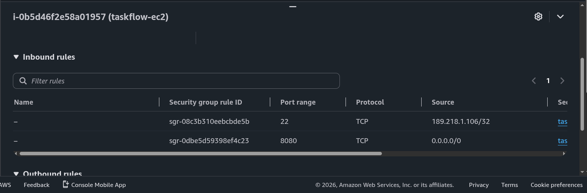
  <br>
  <sub><em>Reglas de entrada (Inbound Rules) en el Security Group de la instancia</em></sub>
</div>

Uno de los requerimientos que tiene el manejar el despliegue utilizando los servicios y ecosistema de AWS es la necesidad de instalar la herramientas necesarias para nuestra aplicación dentro de nuestra instancia EC2. Nuestro proyecto de `taskflow-api` está contruido con Java 21, por lo que para su posible ejecución es necesario la instalación de Java 21 en `taskflow-ec2`, por lo que para realizar este procedimiento hacemos uso de la conexión por SSH que creamos hacía la instancia desde nuestro ambiente local por medio de la terminal, una vez adentro del servidor procedemos con la instalación de `java-21-amazon-corretto-headless`.

Este procedimiento consta de los siguientes pasos:

1. **Abrir nuestra terminal** en dónde tengamos guardado nuestro archivo `.pem` de autenticación.
2. **Modificar los permisos de nuestra *key*** a solo de lectura:
   ```bash
   chmod 400 taskflow-key.pem
   ```
3. **Ejecutar el siguiente comando** sustituyendo `'<ip-ec2>'` por la IP pública de la instancia:
   ```bash
   ssh -i taskflow-key.pem ec2-user@<ip-ec2>
   ```
4. **Una vez adentro de la instancia**, procedemos a la instalación de Java 21:
   ```bash
   sudo dnf install -y java-21-amazon-corretto-headless
   ```
5. **Confirmamos** que la instalación haya sido correcta:
   ```bash
   java -version
   ```

<div align="center">
  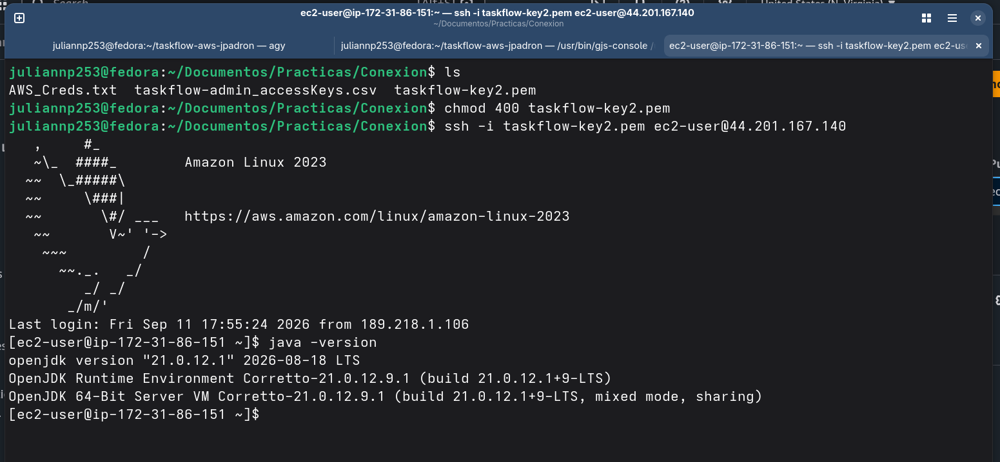
  <br>
  <sub><em>Conexión SSH a la instancia EC2 y confirmación de instalación de Java 21</em></sub>
</div>

---

### 🪣 S3 - Simple Storage Service

> **Amazon S3** es un servicio de almacenamiento de objetos diseñado para guardar y recuperar cualquier cantidad de datos desde cualquier lugar de internet.

#### Componentes
- **Buckets**: Son los contenedores principales. Estos contenedores deben de tener un nombre único a nivel mundial en todo AWS
- **Objects**: El archivo en sí. Está compuesto por los datos, los metadatos (etiquetas, tipo de contenido) y una Key.
- **Clases de almacenamiento**: S3 tiene "niveles" según qué tan rápido necesitas acceder a los datos.
- **Bucket Policies**: Documentos JSON pegados directamente al bucket que definen quién puede acceder a sus objetos.

#### Nuestro Bucket S3

Como vimos en nuestro mapa inicial de todo nuestro pipeline, el bucket que creamos nos sirve para almacenar adentro de él el archivo `.zip` generado por el **CodeBuild** que incluye los archivos `.jar` + appspec + taskflow.service + scrips/*, que son necesarios en la etapa de deploy para el despliegue de nuestra aplicación.

En resumen nuestro S3 Bucket llamado `taskflow-artefactos-julianpadron` (nuestro Objeto) almacenará el empaquetado de nuestra aplicación que será desplegado posteriormente.

<div align="center">
  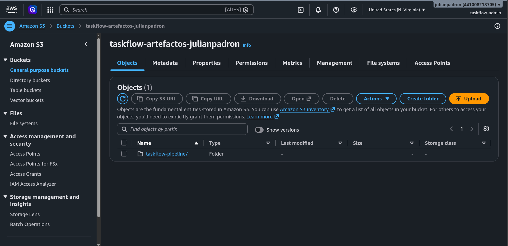
  <br>
  <sub><em>Bucket S3 taskflow-artefactos-julianpadron para el almacenamiento de artefactos</em></sub>
</div>

---

### 🗄️ RDS - Relational Database Service

> **Amazon RDS (Relational Database Service)** es un servicio web administrado que facilita la configuración, operación y escalado de bases de datos relacionales en la nube de AWS. Se encarga de tareas rutinarias de administración como aprovisionamiento de hardware, parches de software, copias de seguridad automáticas y recuperación ante desastres.

#### Componentes
- **DB Instances**: Entornos de base de datos aislados en la nube donde corre el motor relacional seleccionado.
- **Motores compatibles**: Soporta motores estándar de la industria como PostgreSQL, MySQL, MariaDB, Oracle, Microsoft SQL Server y Amazon Aurora.
- **Multi-AZ Deployment**: Replicación síncrona automática de los datos en una segunda Zona de Disponibilidad (AZ) para alta disponibilidad y conmutación por error inmediata.
- **Read Replicas**: Copias de solo lectura para descargar el tráfico de consultas de la base de datos principal y mejorar el rendimiento.
- **DB Subnet Groups**: Conjunto de subredes (generalmente privadas) designadas para aislar la base de datos dentro de una VPC.

#### Usos ideales

| ✅ Ideales para | ❌ No ideales para |
|---|---|
| • **Aplicaciones relacionales tradicionales:** Sistemas que requieren soporte ACID estricto, transacciones complejas, esquemas normalizados y relaciones de tablas (Foreign Keys, JOINs).<br><br>• **Migración de bases de datos existentes:** Aplicaciones empresariales construidas para motores como PostgreSQL o MySQL que buscan reducir la carga operativa de mantenimiento sin reescribir código. | • **Datos no estructurados o esquemas altamente dinámicos:** Modelos de datos con atributos que cambian constantemente o sin relaciones fijas.<br><br>• **Cargas extremas de lectura/escritura a escala masiva:** Requerimientos de millones de operaciones por segundo con latencias de un solo dígito de milisegundo (donde NoSQL como DynamoDB sobresale). |

---

### ⚡ DynamoDB - NoSQL Database Service

> **Amazon DynamoDB** es un servicio de base de datos NoSQL de documentos y clave-valor completamente administrado y serverless, diseñado para ofrecer un rendimiento rápido y predecible con latencias de milisegundos a cualquier escala.

#### Componentes
- **Tablas (Tables)**: Colecciones de elementos sin esquema fijo obligatorio (schema-less), a diferencia de las tablas relacionales.
- **Elementos (Items)**: Conjunto de atributos que representan un registro único dentro de la tabla (equivalente a una fila).
- **Atributos (Attributes)**: Elementos de datos individuales dentro de un item (equivalente a columnas o campos JSON).
- **Claves Primarias (Primary Keys)**:
  - **Partition Key (PK)**: Clave de partición simple que determina en qué partición física se almacenan los datos mediante una función hash.
  - **Sort Key (SK)**: Clave de ordenamiento opcional que, combinada con la Partition Key, forma una clave compuesta para consultas avanzadas y rangos.
- **Capacidad (Throughput)**: Modos de capacidad bajo demanda (*On-Demand*) o aprovisionada (*Provisioned*).

#### Usos ideales

| ✅ Ideales para | ❌ No ideales para |
|---|---|
| • **Cargas de trabajo a hiperescala y baja latencia:** Aplicaciones móviles, carritos de compras, sesiones de usuario, catálogos de productos y tracking de eventos en tiempo real.<br><br>• **Arquitecturas Serverless:** Integración nativa con AWS Lambda y microservicios donde no se desea gestionar servidores ni pools de conexiones. | • **Consultas complejas con múltiples JOINs:** Consultas analíticas pesadas o agregaciones relacionales complejas entre múltiples tablas.<br><br>• **Sistemas fuertemente relacionales:** Donde la integridad referencial y las transacciones cruzadas entre entidades son indispensables. |

#### Práctica y Configuración mediante AWS CLI

En la práctica de clase, los comandos y la manipulación de DynamoDB se realizaron directamente a través de la **AWS CLI** desde la computadora local (laptop) en lugar de la consola gráfica web. Esto permite dejar un rastro reproducible de comandos para validación y auditoría.

Para que la CLI pueda actuar y autenticarse en nombre de nuestro usuario administrador `taskflow-admin`, se requirió configurar sus credenciales de acceso:

1. **Instalar la AWS CLI:**
   - Comprobar disponibilidad con `aws --version`. Si no estaba instalada, se descarga mediante `brew install awscli` (macOS), instalador MSI (Windows) o el paquete oficial para Linux.
2. **Generar la clave de acceso en IAM:**
   - En la consola de AWS: **IAM** ➡️ **IAM users** ➡️ seleccionar `taskflow-admin` ➡️ pestaña **Security credentials** ➡️ sección *Access keys* ➡️ **Create access key**.
   - Caso de uso: *Command Line Interface (CLI)*.
   - Descripción asignada: `laptop`.
   - Descarga y resguardo del archivo de credenciales (`.csv`) con el *Access Key ID* y la *Secret Access Key*.
3. **Configurar y verificar la CLI en la terminal:**
   Se ejecutó el asistente interactivo de configuración y la validación de identidad con los siguientes comandos:

```bash
aws configure
#  AWS Access Key ID:      la Access key
#  AWS Secret Access Key:  la Secret access key
#  Default region name:    us-east-1   (us-east-2 si tu cuenta es de la experiencia nueva)
#  Default output format:  json

# Desactivar el paginador para evitar que respuestas largas bloqueen la terminal con ":"
aws configure set cli_pager ""

# Confirmar identidad y cuenta activa vinculada al usuario administrador
aws sts get-caller-identity     # debe devolver tu cuenta y arn:aws:iam::…:user/taskflow-admin
```

> **Puesta en práctica en clase:** DynamoDB se utilizó de forma práctica mediante estos comandos de la AWS CLI para ejercitar la persistencia NoSQL y la administración programática de recursos en AWS. Al igual que con RDS, los recursos fueron eliminados tras la práctica para evitar consumo fuera del alcance del pipeline CI/CD final.

---

## 2. ⚙️ Creación de nuestro Pipeline 

<div align="center">
  
  <br>
  <sub><em>Flujo de despliegue automatizado de CodePipeline a EC2</em></sub>
</div>

Para llevar a cabo la creación de nuestro Pipeline completo, llevamos a cabo los siguientes pasos:

---

### Paso 1: Crear un nuevo IAM Role

Nuestra instancia `taskflow-ec2` solo nos permite elegir roles que ya existen. Nuestro S3 bucket que creamos es un recurso privado por seguridad, no permite el acceso a nadie, por lo que al crear este rol `taskflow-ec2-role` que adjuntaremos a nuestra instancia para poder permitir la lectura del objeto en nuestro bucket.

<div align="center">
  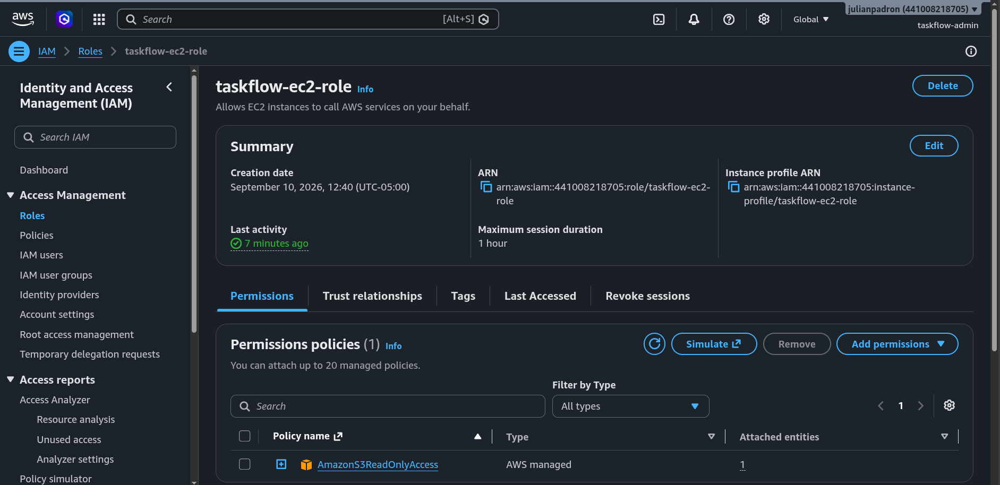
  <br>
  <sub><em>Creación del rol taskflow-ec2-role con permisos para lectura de Amazon S3</em></sub>
</div>

---

### Paso 2: Asignación de nuevo rol a EC2

Nuestra instancia debe de llevar en ella `taskflow-ec2-role` para que el agente pueda bajar el artefacto de S3.

---

### Paso 3: Crear Agente CodeDeploy

Para la parte de deploy hacemos uso de un Agente que será el encargado de realizar el procedimiento de obtener el `.jar` del bucket, detener la aplicación actual (**parar.sh**), instalar nueva aplicación (**permisos.sh**), arrancar la nueva versión (**arrancar.sh**), y verificar que todo este correctamente corriendo (**verificar.sh**).

Para su instalación debemos entrar a la instancia por medio de SSH y seguimos los siguientes comandos:

```bash
sudo dnf install -y ruby wget
cd /home/ec2-user
REGION=us-east-1        # ← us-east-2 si tu cuenta es de la experiencia nueva (Ohio)
wget https://aws-codedeploy-$REGION.s3.$REGION.amazonaws.com/latest/install
head -1 install         # tiene que decir: #!/usr/bin/env ruby
chmod +x ./install
sudo ./install auto
sudo systemctl status codedeploy-agent
```

---

### Paso 4: Cableado del pipeline

Se cablea de atrás hacia adelante: primero quien despliega (**CodeDeploy**), luego el director de orquesta (**CodePipeline**), que crea el proyecto de build por el camino.

#### 1. Rol de CodeDeploy en IAM
Creamos nuestro `taskflow-code-deploy` rol de CodeDeploy dentro de la consola IAM. Este rol otorga a **CodeDeploy** los permisos para interactuar con otros servicios de AWS.

<div align="center">
  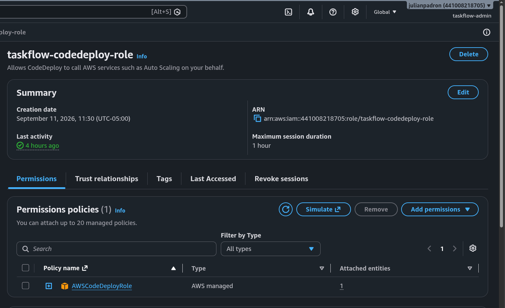
  <br>
  <sub><em>Rol taskflow-code-deploy con permisos de servicio para AWS CodeDeploy</em></sub>
</div>

#### 2. Grupo de Despliegue en CodeDeploy
Creamos nuestro grupo de despliegue en la consola de **CodeDeploy** dentro de nuestra aplicación `taskflow`.

<div align="center">
  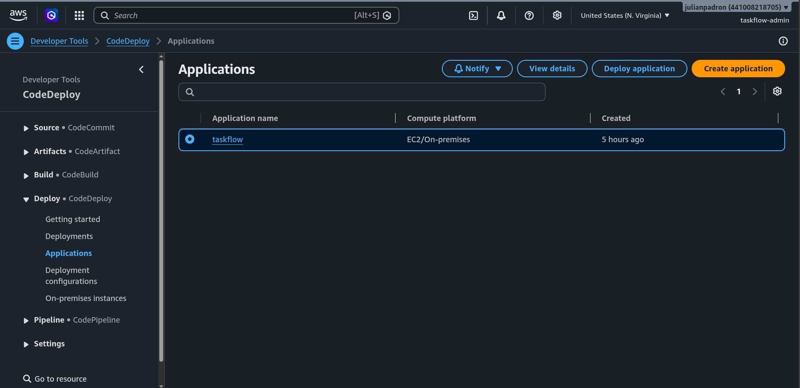
  <br>
  <sub><em>Configuración del grupo de despliegue taskflow-dg en AWS CodeDeploy</em></sub>
</div>
 
En esta consola podemos observar cada uno de los despliegues que se han hecho junto con sus infromación adicional.

<div align="center">
  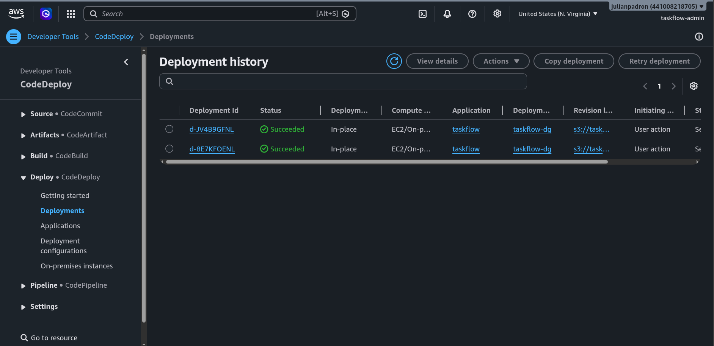
  <br>
  <sub><em>Historial y eventos del ciclo de vida de los despliegues ejecutados</em></sub>
</div>

#### 3. Conexión en CodePipeline
El pipeline, aquí en esta etapa es en donde conectaremos cada servicio, integrante del flujo. En nuestra consola de **CodePipeline** encontramos el pipeline `taskflow-pipeline` que maneja las siguientes conexiones:
- **Name**: `taskflow-pipeline`
- **Source**: configuramos nuestro proveedor, en este caso es GitHub conectada a nuestro repositorio `taskflow-aws-jpadron`
- **Build Stage**: Agregamos *AWS CodeBuild* como build provider, el cual tomará como referencia de empaquetado el archivo **buildspec.yml** en nuestro proyecto
- **Deploy Stage**: Agregamos *AWS CodeDeploy* como deploy provider seleccionando el grupo de despliegue `taskflow-dg` que creamos previamente.

<div align="center">
  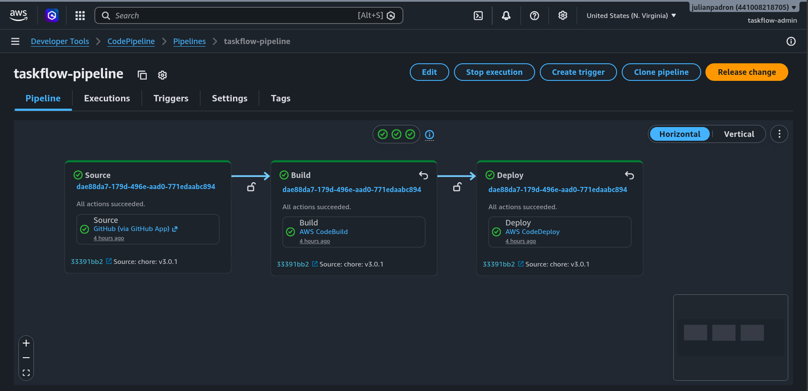
  <br>
  <sub><em>Consola de AWS CodePipeline mostrando la ejecución exitosa de Source, Build y Deploy</em></sub>
</div>

---

## 3. 🎯 Conclusiones y Aprendizajes Clave

### Resumen del Proyecto
A través de este proyecto se logró la implementación exitosa de un pipeline de **Integración y Despliegue Continuo (CI/CD)** completamente funcional en AWS. Se transformó un proceso de despliegue tradicionalmente manual, propenso a errores y dependiente de conexiones SSH interactivas, en un flujo automatizado y desacoplado donde cada `git push` a la rama `main` activa la compilación, el empaquetado de artefactos inmutables y la actualización transparente de la aplicación en producción.

